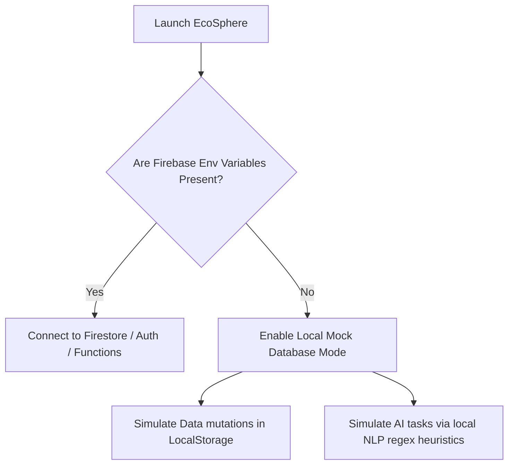

# 

# EcoSphere

> **EcoSphere** is a state-of-the-art, enterprise-grade ESG (Environmental, Social, and Governance) Management and Employee Gamification Platform. It combines carbon accounting, CSR activity tracking, regulatory compliance auditing, and employee rewards into a cohesive, beautiful web experience designed to align corporate impact with individual action.

[](https://vite.dev)
[](https://react.dev)
[](https://www.typescriptlang.org)
[](https://tailwindcss.com)
[](https://firebase.google.com)
[](https://www.framer.com/motion/)

---

## 📖 Table of Contents

1. [Key Features](#-key-features)
   - [Overview Dashboard](#overview-dashboard)
   - [Environmental Pillar (E)](#environmental-pillar-e)
   - [Social Pillar (S)](#social-pillar-s)
   - [Governance Pillar (G)](#governance-pillar-g)
   - [Gamification & Engagement](#gamification--engagement)
   - [Reporting & System Config](#reporting--system-config)
2. [🎨 Design & Aesthetics](#-design--aesthetics)
3. [📊 ESG Scoring Mathematics](#-esg-scoring-mathematics)
4. [🛠️ Technical Architecture](#%EF%B8%8F-technical-architecture)
5. [💡 Database Mode & Fallbacks](#-database-mode--fallbacks)
6. [🚀 Quick Start & Installation](#-quick-start--installation)
7. [⌨️ Keyboard Shortcuts & Command Palette](#%EF%B8%8F-keyboard-shortcuts--command-palette)
8. [🗃️ Seeding & Demo Persona Directory](#%EF%B8%8F-seeding--demo-persona-directory)

---

## 🌟 Key Features

### Overview Dashboard
* **Integrated KPI Cards:** View the aggregate ESG Score, alongside individual Environmental, Social, and Governance pillar scores.
* **Custom Growth Gauges:** Track score trends using high-fidelity radial progress rings.
* **AI Summary & Forecast:** Generates real-time, context-aware narratives summarizing organization status and projecting next-quarter compliance/emissions directions.
* **Central Audit Trail:** An aggregated log of carbon transactions, CSR activities, and compliance issues.

### Environmental Pillar (E)
* **Carbon Emissions Ledger:** Log and audit carbon-generating activities across Scopes 1, 2, and 3.
* **AI Transaction Assistant:** Describe activities in plain English (e.g., *"We flew 4 passengers from NY to London for an executive offsite"*), and the system automatically matches the appropriate Emission Factor, scope, and calculates the total CO₂e footprint.
* **Emission Factor Database:** Core CRUD controls to adjust activity factor weights (`kg CO2e / unit`) and effective dates.
* **Goal Tracker:** Establish and track departmental limits (e.g., `Carbon Emissions`, `Energy Usage`, `Water Usage`) with real-time indicators showing if they are `On Track`, `At Risk`, `Achieved`, or `Missed`.
* **Visual Recharts Analytics:** Bar chart breakdown comparing emissions against targets.

### Social Pillar (S)
* **CSR Activities Manager:** Create volunteering, health, safety, or inclusion events. Employees can sign up to join.
* **Participation Verification:** A dedicated review screen for department heads to review proof of attendance, approve volunteer hours, and trigger Green Points/XP rewards.
* **Diversity Metrics:** Live charts tracking headcount share and gender distribution across departments.
* **Compliance Training Logs:** Audit completion of critical training modules.

### Governance Pillar (G)
* **Corporate Policy Register:** Document policies (e.g., Code of Conduct, Information Security, Whistleblower Guidelines) and catalog active versions.
* **Acknowledge Tracker:** Track acknowledgments per employee. Send manual email/system reminders for compliance.
* **Scheduled Audits Scheduler:** Track upcoming and completed internal/external ESG audits, detailing scheduled dates, auditors, and findings.
* **AI-Assisted Risk/Severity classification:** Write compliance issue summaries, and local heuristic or cloud AI suggests risk severity (`Low`, `Medium`, `High`, `Critical`) and remediation timescales.

### Gamification & Engagement
* **Green Points Engine:** Real-time balance calculations. Employees earn points for completing carbon-saving challenges or volunteering.
* **Badge Milestones:** Automatic awards for accomplishments (e.g. *Canopy Pioneer* or *Carbon Champion*) using triggers based on XP and activity counts.
* **Pillar Challenges:** Actionable corporate tasks categorized by difficulty (`Easy`, `Medium`, `Hard`) with Framer-motion interactions.
* **Leaderboards:** Real-time organization rankings by XP or points, filterable by department.
* **Rewards Store:** Redeem accrued Green Points for sustainable items or corporate perks.

### Reporting & System Config
* **Excel Exporting (`xlsx`):** Instantly compile and download formatted data sheets for Environmental, Social, Governance, or summary audits.
* **ESG Pillar Weight Adjustment:** Dynamically modify relative weights (e.g., Environmental: 40%, Social: 30%, Governance: 30%) with immediate recalculations across all cards, charts, and metrics.
* **Auto-Emission Calculators:** Toggle optional automated calculation triggers.

---

## 🎨 Design & Aesthetics

EcoSphere is styled using **Tailwind CSS v4** with a custom-themed system:
* **Deep Emerald Theme:** The app background (`--color-canvas: #0A0F0D`) and surfaces (`--color-surface-1: #101714` / `--color-surface-2: #141D19`) create a rich tech atmosphere that evokes natural environments.
* **Vibrant Accent Colors:**
  * **Environmental:** Green (`#22C55E`)
  * **Social:** Blue (`#3B82F6`)
  * **Governance:** Purple (`#A855F7`)
  * **Gamification (XP/Gold):** Amber (`#FBBF24`)
* **Responsive Layout:** Complete navigation shell with Framer-motion transitions and layout-guided responsive grids.
* **Custom Typography:** Cal Sans for headers and Inter for system fonts.

---

## 📊 ESG Scoring Mathematics

The overall ESG index score is calculated dynamically based on three pillar-specific algorithms:

### 1. Environmental Score ($E_{score}$)
The score evaluates carbon emissions relative to the target limit set for the department:
$$E_{score} = \max\left(0, \min\left(100, 100 \times \left(1 - \frac{\text{Total Carbon Emissions (kg)}}{\text{Target Limit (kg)}} \times 0.5\right)\right)\right)$$
*If no specific goal is configured, it defaults to a **5,000 kg CO₂e** benchmark.*

### 2. Social Score ($S_{score}$)
The Social Score represents a blended average of three core compliance rates:
$$S_{score} = \frac{\text{CSR Participation Rate} + \text{Challenge Completion Rate} + \text{Policy Acknowledgement Rate}}{3}$$
* $\text{CSR Participation Rate} = \min\left(100, \frac{\text{Approved Volunteering Count}}{\text{Total Employees}} \times 100\right)$
* $\text{Challenge Completion Rate} = \min\left(100, \frac{\text{Approved Challenge Submissions}}{\text{Total Employees}} \times 100\right)$
* $\text{Policy Acknowledgement Rate} = \frac{\text{Acknowledged Policies}}{\text{Total Policy Assignments}} \times 100$

### 3. Governance Score ($G_{score}$)
The Governance Score starts at **100** and receives deductions for open compliance issues and outstanding/overdue policy signoffs:
$$G_{score} = \max\left(0, 100 - \sum \text{Risk Penalties} - \sum \text{Signoff Penalties}\right)$$
* **Risk Penalties (Open Issues):**
  * `Critical` Issue: **-30 pts**
  * `High` Issue: **-15 pts**
  * `Medium` Issue: **-8 pts**
  * `Low` Issue: **-3 pts**
* **Signoff Penalties:** **-5 pts** for every outstanding policy signoff where a compliance reminder has been issued.

### 4. Overall ESG Score ($ESG_{total}$)
Calculated using weighted department-level aggregates:
$$ESG_{total} = \frac{E_{score} \times W_E + S_{score} \times W_S + G_{score} \times W_G}{W_E + W_S + W_G}$$
*(Default weights: $W_E = 40, W_S = 30, W_G = 30$.)*

---

## 🛠️ Technical Architecture

The application layout is structured logically to separate business domains:

```text
ecosphere/
├── src/
│   ├── components/
│   │   ├── layout/            # Shell wrapper, Sidebar, Topbar, Auth guards
│   │   └── ui/                # Growth ring gauges, CommandPalette, Inline editing cells
│   ├── context/               # Auth, Toast, Theme context providers
│   ├── hooks/                 # Keyboard shortcuts, Optimistic UI mutation hooks
│   ├── lib/
│   │   ├── badges.ts          # Auto badge eligibility engine
│   │   ├── firebase.ts        # Firestore configuration / Mock database logic
│   │   ├── scoring.ts         # Math logic for ESG Scoring
│   │   └── seed.ts            # Local database seeding payload
│   ├── pages/                 # ESG Pillar views, Gamification, Reports, settings
│   ├── types/                 # Typescript schemas (Employee, Audit, Transaction, etc.)
│   ├── App.tsx                # App route mapping
│   ├── index.css              # Custom Tailwind css theme configuration
│   └── main.tsx               # DOM Entry point
├── package.json
└── vite.config.ts
```

---

## 💡 Database Mode & Fallbacks

EcoSphere is designed to support **both cloud deployments and zero-config local runtimes**:



### 1. Firebase Cloud Mode
Configured when keys are loaded into your environment. It connects to:
* **Firebase Firestore** for records database.
* **Firebase Authentication** for user login.
* **Firebase Cloud Functions** (e.g., `callEsgAI` function) for advanced LLM categorization, report generation, and severity tagging.

### 2. Local Fallback Mode
If credentials are absent, EcoSphere activates a fully-featured **mock database client** (`MockFirestoreDb` and `MockAuthService` inside [firebase.ts](file:///c:/Users/WELCOME/Downloads/ecosphere-phase1/ecosphere/src/lib/firebase.ts)):
* Saves state locally in `localStorage` (`ecosphere_db_fallback` / `ecosphere_auth_fallback`).
* Replaces cloud AI calls with **local regex heuristics** that analyze text keywords to suggest transaction categories and compliance risks.
* Allows developer sandbox evaluations instantly.

---

## 🚀 Quick Start & Installation

### 1. Clone & Install Dependencies
Navigate to the directory and install dependencies:
```bash
cd ecosphere
npm install
```

### 2. Set Up Credentials (Optional)
To connect to live Firebase services, rename `.env.local.example` to `.env.local` and enter your keys:
```env
VITE_FIREBASE_API_KEY=your_key
VITE_FIREBASE_AUTH_DOMAIN=your_auth_domain
VITE_FIREBASE_PROJECT_ID=your_project_id
VITE_FIREBASE_STORAGE_BUCKET=your_storage_bucket
VITE_FIREBASE_MESSAGING_SENDER_ID=your_sender_id
VITE_FIREBASE_APP_ID=your_app_id
```
*Leave blank to run in mock mode.*

### 3. Run Development Server
```bash
npm run dev
```
Open [http://localhost:5173](http://localhost:5173) in your browser.

### 4. Populate Database
On the first run, go to **Settings** > **Database Seeding** and click **Seed Database**. This seeds Firestore or `localStorage` with mock organizations, employees, and policies.

---

## ⌨️ Keyboard Shortcuts & Command Palette

EcoSphere supports advanced keyboard mappings for power-users:

### Navigation Shortcuts
Press `g` followed by one of these keys to redirect instantly:
* `g` + `d` : Go to **Dashboard Overview**
* `g` + `e` : Go to **Environmental Pillar**
* `g` + `s` : Go to **Social Pillar**
* `g` + `o` : Go to **Governance Pillar**
* `g` + `g` : Go to **Gamification Center**
* `g` + `r` : Go to **Reports Hub**
* `g` + `c` : Go to **System Settings**

### Global Controls
* <kbd>Ctrl</kbd> + <kbd>K</kbd> / <kbd>Cmd</kbd> + <kbd>K</kbd> : Toggle the search **Command Palette**.
* <kbd>/</kbd> : Auto-focus the search filter input field on any active tab.
* <kbd>?</kbd> : Open the Keyboard Shortcuts help overlay guide.
* <kbd>Esc</kbd> : Close open modals, help menus, or palettes.

---

## 🗃️ Seeding & Demo Persona Directory

Seeding the database creates the following profiles for demo exploration:

| Name | Email | Department | Role | Starting Badge(s) | XP |
| :--- | :--- | :--- | :--- | :--- | :--- |
| **Thiru** | `thiru@ecosphere.com` | Sustainability (Canopy) | Admin | Pioneers, Carbon Saver | `1240` |
| **Elena Rostova** | `elena@ecosphere.com` | Executive Suite | Admin | Canopy Pioneers | `450` |
| **Marcus Vance** | `marcus@ecosphere.com` | Operations & Logistics | Dept Head | Pioneers, CSR Champ | `850` |
| **Aisha Kante** | `aisha@ecosphere.com` | Social Relations & CSR | Dept Head | Pioneers, CSR Champ | `720` |
| **Sarah Jenkins** | `sarah@ecosphere.com` | Corporate Gov & Legal | Dept Head | Canopy Pioneers | `680` |
| **John Doe** | `john@ecosphere.com` | Operations & Logistics | Employee | *None* | `150` |
| **Jane Smith** | `jane@ecosphere.com` | Sustainability (Canopy) | Employee | Canopy Pioneers | `320` |

*Password for all local accounts is `password` (used in auth simulation).*
